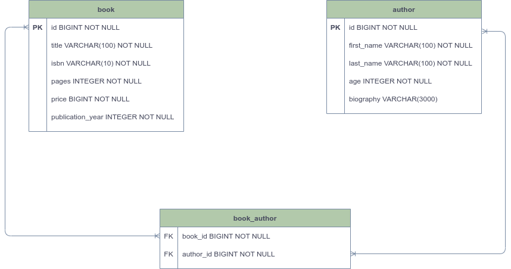
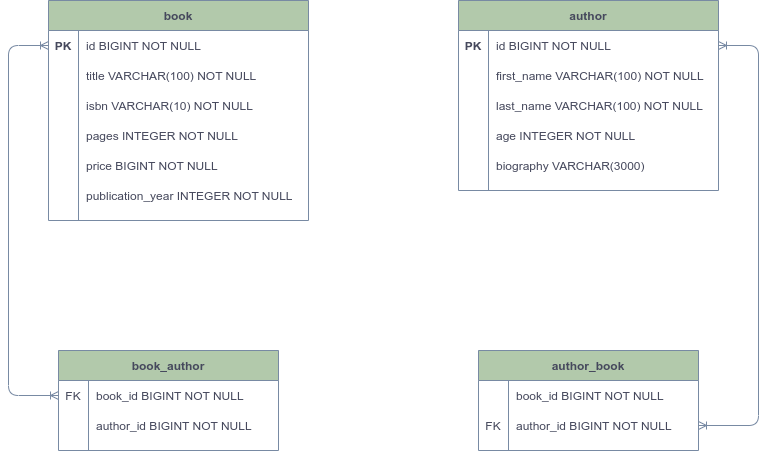

# FastAPI + SQLAlchemy DDD Example

이 프로젝트는 Python의 FastAPI 프레임워크와 SQLAlchemy ORM을 이용한 Domain Driven Development 아키텍처 예제 프로젝트입니다.

<br />

## How to run

이 프로젝트를 위해 필요한 요구 사항은 다음과 같습니다.

* Python 3.9 버전 이상
* PostgreSQL 11 버전 이상

```shell
$ poetry install
```

이 프로젝트는 Poetry를 이용하여 디펜던시를 관리합니다. 따라서 ```poetry``` 명령어 사용을 권장하며 위 명령어로 이 애플리케이션을 실행하기 위한 디펜던시 설치를 진행할 수 있습니다.

```shell
$ poetry export -f requirements.txt --output requirements.txt 
```

만약, ```pip``` 혹은 ```pipx```와 같은 기본 파이썬 패키지 관리자로 설치를 원한다면 위 명령어를 이용해 requirements.txt 파일을 추출받으십시오.

```shell
$ pip install -r requirements.txt
```

그런 다음, 기본 파이썬 패키지 관리자로 디펜던시 설치를 진행할 수 있습니다.

```shell
$ uvicorn app:app --host=0.0.0.0 --loop=uvloop
```

이 프로젝트는 비동기 함수로 구현되어 있습니다. 따라서 uvicorn 명령어를 이용해 서버를 실행하는 것을 권장합니다.

<br />

## ERD

이 프로젝트는 **PostgreSQL**을 사용합니다. 책(Book)과 저자(Author)라는 두 가지 도메인을 이용하여 도서를 관리하는 프로젝트를 파이썬에서 DDD를 구현하기 위한 예시로 사용하였습니다.



한 사람이 책을 여러권 쓸 수 있고, 책에는 여러 저자가 들어갈 수 있기 때문에 이런 경우 위와 같이 Many-to-Many 형태로 많이 설계할 것입니다.

-> ***하지만 DDD에서 Many to Many 설계는 좋은 설계가 아닙니다.***

<br />

DDD의 목적은 요구사항을 도메인으로 정의하고 이를 단순화 시키는 데 있습니다. 하지만 현실세계에서 두 사물의 관계는 위처럼 다대다(Many-toMany) 관계가 엄청 흔한데, 이런 현실 세계를 그대로 모델링하면 **구현과 유지보수가 복잡**해질 뿐 아니라 해당 도메인의 특성이 무색해지면서 오히려 **도메인을 이해하는 데 어려움**을 초래합니다.



그러므로 가능한 위 ERD처럼 Many-to-Many에서 벗어나 One-To-Many의 단방향 형태를 통해 가능한 관계를 제약하는 것이 중요합니다. 

<br />

## SQLAlchemy classical mapping

SQLAlchemy는 Python ORM 라이브러리입니다. 이 라이브러리에서 제공하는 고전적인 매핑(Classical Mapping)은 DDD와 아주 궁합이 맞는 방법이며 우리가 별도의 Mapper를 구현하지 않아도 도메인 모델 그대로를 DB에 영속하고 가져올 수 있습니다.

```python
from abc import abstractmethod
from typing import Protocol

from . import D, P


class ModelMapper(Protocol[D, P]):
    @staticmethod
    @abstractmethod
    def map_to_domain_entity(model: P) -> D:
        ...

    @staticmethod
    @abstractmethod
    def map_to_persistence_entity(model: D) -> P:
        ...
```

일반적으로 우리가 ORM을 이용해 DB에 영속한다면 ORM 모델(Entity 모델)과 Domain 모델을 분리하게 되는데, 그러면 DB에 영속하거나 가져올 때 불러오는 ORM 모델을 Domain 모델로 변환해주는 Mapper를 구현해야 합니다. (***그렇지 않으면 ORM에 의존하는 모델이 되며 도메인 모델에 저장소와 관련된 관심사 모델이 되어 버린다***)

(이 프로젝트에서는 예시의 이해를 위해 평범하게 사용하는 mapper와 SQLAlchemy에서 사용하는 mapper 두 가지를 모두 구현하였습니다)

```python
def start_mapper():
    t = BookEntity.__table__
    rt = BookAuthorEntity.__table__

    mapper_registry.map_imperatively(Book, t, properties={
        'authors': relationship(BookAuthor, backref=backref("book"), lazy='joined')
    })
    mapper_registry.map_imperatively(BookAuthor, rt, properties={
        'books': relationship(Book, backref=backref("author", cascade="all, delete-orphan"), lazy='joined')
    })
```

하지만 SQLAlchemy에서 제공하는 ```mapper_registry```를 이용하면 별도의 mapper 구현이나 메서드 호출없이도 도메인 모델로 반환시켜줍니다. 

Classical Mapper를 사용하려면 ```Table```로 정의된 코드가 필요한데, 만약 ORM 모델과 같이 사용하기 원한다면 ORM 모델을 구현한 후, ```__table__``` 매직 메서드를 이용하여 손쉽게 Table 형태로 불러올 수 있습니다. 

참고: (https://docs.sqlalchemy.org/en/14/orm/mapping_api.html#sqlalchemy.orm.registry.map_imperatively)

<br />

## Snowflake Identifier

식별자는 해당 도메인을 식별하기 위한 번호입니다. 보통 우리는 이러한 식별자를 Database에서 제공하는 auto increment나 UUID를 사용할 것입니다. 이 방법이 틀렸다는 것이 아닙니다.

다만 도메인 주도 개발이기 때문에 가급적 도메인이 생성되는 시점에 식별자를 부여받는 것을 권장하며 그러기 위해서는 Database에서 제공하는 auto increment는 그다지 좋은 선택은 아니어 보입니다. 도메인이 생성되는 시점에 식별자를 주어주기 위해 직접 생성하는 것을 선택했습니다.

[Snowflake ID](https://en.wikipedia.org/wiki/Snowflake_ID)는 2010년, Twitter에서 개발하였으며 timestamp 기반으로 동작합니다.

<br />

## Event Processing

어떤 도메인의 로직이 실행되었을 때 그 요구사항이 **해당 도메인에만 영향을 주는 것이 아닌 다른 도메인까지 영향을 주는 경우**에는 어떻게 문제를 해결할 수 있을까요?

​    -> 책(Book)과 저자(Author) 도메인이 있을 때 저자를 조회해도 저자가 작성한 책이 나와야 하고, 책을 조회했을 때 그 책을 작성한 저자가 나와야 한다면?

우리는 Many-to-Many가 아닌 One-to-Many라는 단방향 구조를 사용했고, 책을 등록하고 저자를 추가할 때, 그 저자의 정보에도 그 책이 추가되어야 합니다. 

(즉, Book 도메인에서 해당 Book의 저자가 추가 되면, 저자 도메인에서도 해당 저자가 쓴 책으로 추가되어야 합니다.)

```python
class Book:
    id: BookId
    title: Title
    isbn: Isbn
    pages: Page
    price: KoreanMoney
    publication_year: Year
    authors: List[BookAuthor] = field(default_factory=list)

    def add_author(self, command: AddAuthorCommand):
        self.authors.append(BookAuthor(book_id=self.id, author_id=command.author_id))
```

```python
class Author:
    id: AuthorId
    name: Name
    age: Age
    biography: Optional[Biography]
    book_ids: List[AuthorBook] = field(default_factory=list)

    def add_book(self, command: AddBookToAuthorCommand):
        self.book_ids.append(AuthorBook(author_id=self.id, book_id=command.book_id))
```

이런 상태일 때, 우리는 3가지를 고려해야 합니다.

1. Book 도메인에서는 트랜잭션이 성공하였으나, Author 도메인에서 트랜잭션이 실패했다면?

2. Author 도메인의 트랜잭션이 길어진다면?

3. 두 도메인 객체의 변경이 이뤄지는데, 그렇다면 useCase는 어느 useCase로 들어가야 할까? 
   (*한 서비스 로직에 두 가지 도메인이 결합되는 경우*)

3번 문제는 심히 **우려할만한 부분**입니다. Book은 책을 표현하는 도메인 객체인데, Author 도메인의 책을 추가하는 로직이라면, 이게 책을 추가하는 것인지 저자를 추가하는 것인지가 구분이 모호해집니다. 

이러한 문제는 바로 책이랑 저자가 엄청 가깝게 붙어 있는 이른 바 **BOUNDED CONTEXT 간의 강결합(high coupling) 문제**입니다. 이러한 문제를 해결하기 위해서는 이벤트(Event)를 이용하는 방법이 있습니다. **과거에 어떤 일이 발생(상태 변경)**했고. **그 일이 발생하여 이 일을 수행**한다. 라는 맥락입니다.


도메인 모델에서 이벤트 주체는 도메인 객체가 되며 도메인 로직을 실행하여 상태가 바뀌면 관련 이벤트를 발생시키는 방향으로 구현할 수 있습니다.

Event Handler는 Event Delegator가 서비스 로직에서 발생한 이벤트에 반응하며 해당 이벤트에 담긴 데이터를 이용해 원하는 기능을 수행하는 방향으로 갈 수 있습니다. 이러한 이벤트 내 담긴 데이터에는 아래와 같은 정보를 담게 됩니다.

- 이벤트 종류: 클래스 이름 (Pydantic BaseModel 혹은 Python dataclass)으로 표현
- 추가 데이터: 상태가 변경된 도메인과 연관된 데이터

```python
from pydantic import BaseModel


class AuthorAddedToBookDomainEvent(BaseModel):
    book_id: int
    author_id: int
```

이벤트 클래스 이름을 네이밍할 때는 *Changed*, *Added*와 같은 과거형을 사용하는 것이 좋습니다. 비록 이벤트가 현재 기준으로 이뤄진 것이다 할지더라도 과거에 나타난 상태 변경에 의해 이뤄지는 것이기 때문입니다.

이벤트를 사용함으로써 우리는 서로 다른 도메인의 로직이 섞이는 것을 방지하게 되며 차후 이러한 모습은 마이크로서비스 아키텍처(MSA)로 마이그레이션하기 유리한 조건으로 갈 수 있는 뛰어난 모놀리식 개발 방법입니다.

<br />

## Unit Of Work and Repository

저장소 패턴(Repository)은 영속적 저장소(DB)를 추상화 한 것입니다. 파이썬에서는 클래스를 추상화 하기 위해 ```ABC```나 [덕 타이핑](https://ko.wikipedia.org/wiki/%EB%8D%95_%ED%83%80%EC%9D%B4%ED%95%91#:~:text=%EC%BB%B4%ED%93%A8%ED%84%B0%20%ED%94%84%EB%A1%9C%EA%B7%B8%EB%9E%98%EB%B0%8D%20%EB%B6%84%EC%95%BC%EC%97%90%EC%84%9C%20%EB%8D%95,%EC%9D%84%20%EA%B2%B0%EC%A0%95%ED%95%98%EB%8A%94%20%EA%B2%83%EC%9D%84%20%EB%A7%90%ED%95%9C%EB%8B%A4.&text=%EC%97%AC%EA%B8%B0%EC%97%90%EB%8A%94%20%EC%9D%B8%EC%9E%90%EB%A1%9C%20%EB%B0%9B%EC%9D%80,%ED%95%98%EA%B2%A0%EB%8B%A4%EB%8A%94%20%EC%95%94%EC%8B%9C%EA%B0%80%20%EA%B9%94%EB%A0%A4%EC%9E%88%EB%8B%A4.)을 많이 사용하지만 저장소 패턴을 사용할 때는 상속이 아닌 구현의 규칙을 담게 됩니다. 이럴 때는 Python의 ```Protocol```이 더 유용합니다.

```python
from abc import abstractmethod
from typing import Protocol

from modules.book.infrastructure.query.dto import BookDTO


class BookQueryRepository(Protocol):
    @abstractmethod
    async def fetch_by_title(self, title: str) -> BookDTO:
        ...

    @abstractmethod
    async def fetch_by_id(self, _id: int) -> BookDTO:
        ...
```

DDD에 있어 가장 핵심적인 부분은 도메인 모델을 포함하여 그와 관련된 저장소 등이 직접적으로 의존하면 안된다는 것입니다. 따라서 저장소 패턴을 이용해 추상화 함으로써 특정 라이브러리의 의존성을 제거하고, 쉽게 이동할 수 있는 형태로 구현되어야 합니다.

덧붙여 저장소 패턴(Repository)은 DDD 세계에서 아주 흔하게 사용됩니다. Java나 C#에서 Python으로 이동한 개발자라고 해도 이 패턴을 쉽게 알 수 있습니다.

저장소 패턴과 비슷한 패턴으로 액티브 레코드 패턴이 있습니다. 액티브 레코드 패턴은 ORM 모델(저장소 모델)에 로직을 넣어 구현하는 형태로 도메인 모델과 영속성을 분리하는 것이 아주 간단합니다. 이러한 패턴은 Flask-SQLAlchemy에서 흔히 볼 수 있습니다.

참고: (https://calpaterson.com/activerecord.html)

하지만 도메인이 복잡해질수록 위와 같은 패턴은 모델이나 코드의 변경이 어렵다는 측면에서 DDD에서 사용했을 때 오히려 불편함을 초래합니다. 저장소 패턴에서는 도메인의 복잡성에 따라 많아지는 영속 로직을 쉽게 변경할 수 있는 모습을 가지고 있지만 액티브 레코드 패턴은 도메인 모델 변경에 중심을 두었기 때문에 복잡한 로직 변경에는 다소 한계점이 있지요.

```python
from pymfdata.rdb.connection import AsyncEngine
from pymfdata.rdb.usecase import AsyncSQLAlchemyUnitOfWork

from persistence.book.repository import BookRepository


class BookPersistenceUnitOfWork(AsyncSQLAlchemyUnitOfWork):
    def __init__(self, engine: AsyncEngine) -> None:
        super().__init__(engine)

    async def __aenter__(self) -> None:
        await super().__aenter__()

        self.repository = BookRepository(self.session)
```

작업 단위(Unit Of Work)는 우리가 저장소 패턴을 통해 저장소(DB)를 사용하기 위한 필수 데이터들을 포함합니다. SQLAlchemy의 경우 커넥션에서 할당받은 세션(Session)이 있습니다.

참고: (https://github.com/NEONKID/python-mf-data/blob/main/pymfdata/common/usecase.py)

이들 모두 인프라 리소스이기 때문에 사용 후 반납을 해야합니다. 이러한 작업들을 SQLAlchemy에서 자동으로 해주지 않습니다. 다만 기본적으로 SQLAlchemy는 Unit Of Work 패턴을 사용하는데, 기본적으로 제공되는 함수들은 대부분 API 요청 단위(스레드 혹은 태스크)로 관리됩니다.

참고: (https://docs.sqlalchemy.org/en/14/orm/contextual.html)

만약, 하나의 도메인 서비스 로직에서 여러 도메인의 트랜잭션이 발생하는 경우 그들은 서로 독립적이어야 하지만, 기본값으로 사용하게 되면 하나의 세션으로 여러 도메인의 트랜잭션이 한 번에 발생하는데, 이 역시 하나의 도메인 영속 로직에서 두 가지 모두가 실행된다는 것과 같은 맥락일 것입니다. 따라서 도메인 단위로 작업 단위를 적용해 그들의 리소스를 사용할 수 있도록 하는 것이 좋습니다.

<br />

## Command and Query (CQRS)

이 프로젝트에서 도서 조회, 저자 조회 기능을 구현하려면 여러 Agregate에서 데이터를 가져와야 합니다. Book 도메인에서 저자 정보를 가져와야 하고, Author에서 도서 정보를 가져와야 합니다.

***-> 여러 Aggregate에서 데이터를 가져와야 한다면 어떻게 처리하는 것이 좋을까?***

<br />

이러한 고민이 발생하는 이유는 시스템의 상태를 변경할 때와 조회할 때 단일 도메인 모델을 사용하기 때문입니다.

```python
class BookPersistenceAdapter(BaseUseCase[BookPersistenceUnitOfWork], PersistenceAdapter[Book, BookId]):
    def __init__(self, uow: BookPersistenceUnitOfWork) -> None:
        self._uow = uow

    @async_transactional(read_only=True)
    async def find_by_id(self, _id: BookId) -> Book:
        return await self.uow.repository.find_by_pk(_id)
```

우리가 Book 도메인을 영속하기 위해 먼저 해당 도메인 객체가 존재하고 있는지 안하고있는지를 먼저 확인하는데, 이 때 반환하는 값의 형태는 Book 이라는 도메인 모델입니다. 객체 지향으로 도메인 모델을 구현할 때 주로 사용하는 ORM 기법은 도메인의 상태 변경을 구현하는 데는 적합하지만 반대로 **여러 애그리게이트에서 데이터를 가져와 출력하는 기능을 구현하는 데는 적합하지 않습니다.**

이런 구현 복잡도를 낮추는 방법으로 Command와 Query를 분리하는 CQRS가 있습니다.


(***여기서 Command는 상태를 변경하는 기능이고, Query는 사용자 입장에서 상태 정보를 가져오는 기능입니다***)

참고: (https://martinfowler.com/bliki/CQRS.html)

CQRS는 복잡한 도메인에 적합합니다. 도메인이 복잡할수록 명령 기능과 조회 기능이 다루는 데이터 범위에 차이가 발생합니다. 왜 그러냐면, 우리가 조회를 위해서 필요 이상으로 모델 구현이 복잡해지기 때문입니다. 

지금 다루는 예제에서는 간단히 Book과 Author를 다루기 때문에 그리 큰 차이가 발생하지 않지만 CMS와 같은 컨텐츠 관리 시스템이나 커머스의 경우에는 주문-상품-구매자 등 다른 애그리게이트의 데이터를 필요로 하고, CMS의 경우에는 컨텐츠-카테고리-태그 형태로 역시 다른 애그리게이트의 데이터를 필요로 하기 때문에 eager loading과 fetch 같은 **최적화 된 로딩 구현을 위해 모델 구현이 필요 이상으로 복잡**해집니다.

```python
from dataclasses import dataclass
from sqlalchemy.ext.associationproxy import association_proxy
from typing import FrozenSet


@dataclass
class BookDTO:
    id: int
    title: str
    isbn: str
    pages: int
    authors: FrozenSet[int] = association_proxy("book_authors", "author_id")
```

따라서 읽기 모델(DTO)을 별도로 구현하게 함으로써 UI를 위한 별도의 조회(Query) 모델 구현을 통해 조회를 위해서 상태 변경을 위한 도메인 모델을 수정하지 않고도 쉽게 조회 기능을 구현할 수 있습니다.

조회 모델은 단순히 데이터를 읽어와 조회하는 용도로 사용하기 때문에 영속 과정처럼 응용 로직(UseCase) 클래스를 별도로 구현하지 않고, 바로 Router나 Controller에서 구현해도 문제가 되지 않습니다. 다만 데이터를 표현하는 과정에서 몇 가지 로직을 더 필요로 한다면 별도의 응용 로직(UseCase) 클래스를 구현해도 무방합니다.

<br />

## DI (Dependency Injection)

명시적 의존성 주입은 DDD에서 테스트를 더욱 쉽게 해주기 위한 수단입니다.

FastAPI에서는 ```Depends```가 의존성 주입 역할을 합니다. 하지만 이것은 파이썬의 표준 방법인 import 방식이며 이는 **암시적(묵시적) 의존성 주입**입니다. 

물론 암시적 의존성 주입 방식에서 테스트를 위해 무언가 바꿀 수 있도록 몽키 패치(Monkey Patch)를 진행할 수도 있습니다. 그러나 이는 모든 테스트마다 ```mock.patch```를 호출해야 하며 원치 않는 부작용을 방지하기 위해 수많은 Mock을 사용해야 합니다. 

그렇다면 명시적 의존성을 쓰는 방법이 있는데, 명시적 의존성을 사용하면 애플리케이션이 더욱 복잡해집니다. (컨테이너 등을 추가하고, 디펜던시를 관리해야 하는 등) 

이를 댓가로 테스트 코드를 더욱 쉽게 작성할 수 있다면 이 방법을 쓰는 것도 나쁘지 않다고 생각했으며 도메인 로직을 기준으로 여러 애플리케이션 (예: 관리자 API, 사용자 API 등)을 구현해야 한다면, 컨테이너를 사용해 의존성을 관리하는 것이 오히려 이득일 것입니다.

우리가 이 모든 것을 신경써서 구현하기에는 한계가 있다고 느껴진디면 Dependency Injector 라이브러리를 이용해 볼 수 있습니다.

```python
from dependency_injector.containers import DeclarativeContainer
from dependency_injector.providers import Factory, Singleton


class Container(DeclarativeContainer):
    ...
```

의존성을 Singleton, Factory 등 다양한 주입 방식을 제공하고, 애플리케이션이 실행되는 시점에 Container를 생성한 다음, FastAPI에서 제공하는 ```Depends```를 같이 이용하면 api가 호출될 때 해당 의존성을 같이 가져올 수 있습니다.

이런식으로 구성된 컨테이너는 테스트 코드 작성시 ```override```를 통하여 쉽게 의존성을 Mocking하고 구현할 수 있습니다.

```python
import pytest
from unittest.mock import AsyncMock

_use_case_mock = AsyncMock(spec=AddBookToAuthorUseCase)

        
@pytest.mark.asyncio
async def test_example():
    _use_case_mock.invoke.return_value = ...

    with api.container.add_book_to_author_use_case.override(_use_case_mock):
        ...

    _use_case_mock.invoke.assert_called_once_with(...)
```

PEP 20에  **Explicit is better than implicit**라는 문장이 명시되어 있습니다. 따라서 Python 답게 DDD를 구현한다고 한다면 구체적인 것보단 추상적인 것에 의존하는 스타일을 갖춘 명시적 의존성 주입이 더 어울리겠습니다.


