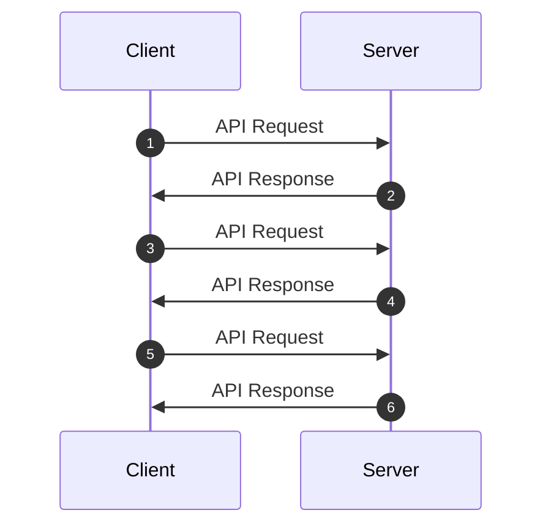
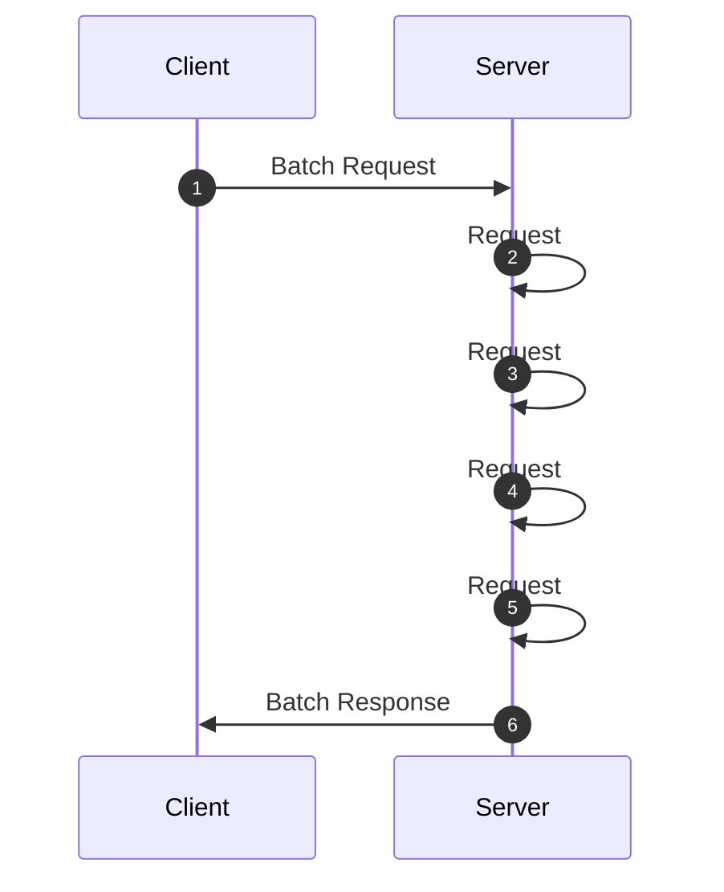

# FastAPI Batch Tutorial
This repository contains a possible implementation of a batch route using FastAPI.
For more details, please check out my blog post on [dev.to](https://dev.to/manukanne/implement-a-batch-route-using-fastapi-444d)

## Description
- Json based batching - The data is exchanged using the MIME type application/json, this approach is 
inspired by the [Microsoft Graph Batch API](https://learn.microsoft.com/en-us/graph/json-batching).
- Batching takes place on the HTTP layer. This approach was chosen to ensure consistent behaviour.

### Why batching
Batching is the process of combining multiple API requests into a single request with a single response. 
Without batching, the whole thing looks like this:


Each request between client and server has a certain network latency, so the processing of 
several consecutive requests can take some time.

With a batch request, the roundtrip between client and server and thus the number of requests can be reduced, 
which in turn rapidly improves performance:


## Getting started
### Prerequites
- Python 3.10

### Run the application
After installing the requirements.txt, please use the following command:
```shell
python main.py
```

This starts the web server for port 8000. 
The OpenAPI definition of the API can be viewed at the URL http://localhost:8000/docs, 
from where the routes can also be tested.

The repository also contains a postman collection, which can be found [here](/postman/FastApi_Batch_Collection.postman_collection.json).

### Sending a Batch Request
Request: 
```http
POST /batch HTTP/1.1
Content-Type: application/json

{
  "requests": [
    {
      "id": "1",
      "url": "/products?skip=0&limit=1",
      "method": "GET"
    },
     {
      "id": "2",
      "url": "/products/1",
      "method": "GET"
    },
    {
        "id": "3",
        "url": "/products",
        "method": "POST",
        "headers": {
            "Content-Type": "application/json"
        },
        "body": {
            "title": "Test Product"
        }
    }
  ]
}
```

Response:
```json
{
    "responses": [
        {
            "id": "1",
            "status": 200,
            "headers": {
                "Server": "uvicorn",
                "Content-Length": "45",
                "Content-Type": "application/json"
            },
            "body": [
                {
                    "title": "Plumbus",
                    "description": "",
                    "id": 1
                }
            ]
        },
        {
            "id": "2",
            "status": 200,
            "headers": {
                "Server": "uvicorn",
                "Content-Length": "43",
                "Content-Type": "application/json"
            },
            "body": {
                "title": "Plumbus",
                "description": "",
                "id": 1
            }
        },
        {
            "id": "3",
            "status": 201,
            "headers": {
                "Server": "uvicorn",
                "Content-Length": "50",
                "Content-Type": "application/json"
            },
            "body": {
                "title": "Test Product",
                "description": null,
                "id": 3
            }
        }
    ]
}
```